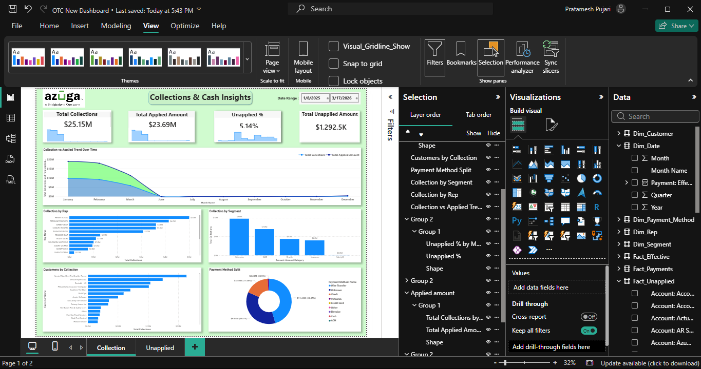
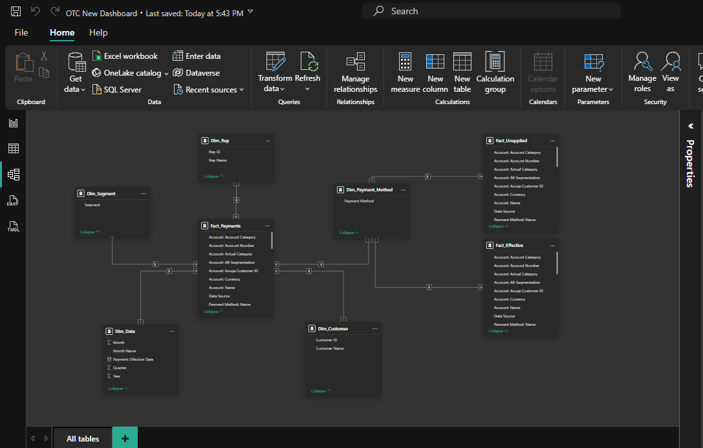

# 📊 O2C Power BI Dashboard

## 🔹 Overview

This project showcases an end-to-end Order-to-Cash (O2C) dashboard built in Power BI. It focuses on Accounts Receivable insights, cash flow tracking, and operational efficiency.

---

## 🔹 Key Features

* AR Aging Analysis (0–30, 31–60, 61–90, 90+ days)
* Cash Application Tracking
* Unapplied Payments Monitoring
* Customer-level and Rep-level KPIs
* Dynamic filters and drilldowns

---

## 🔹 KPIs Included

* DSO (Days Sales Outstanding)
* CEI (Collection Effectiveness Index)
* Total AR Balance
* Overdue Amount %
* Collection Efficiency

---

## 🔹 Tools Used

* Power BI
* Excel / CSV Data
* Data Modeling (Star Schema)
* DAX Calculations

---

## 🔹 Business Impact

* Helps identify overdue invoices and collection risks
* Improves visibility into cash flow
* Supports decision-making for finance teams

---

## 🔹 Files Included

* Power BI Dashboard (.pbix)
* Sample Dataset
* Dashboard Screenshots

---

## 🔹 Author

**Pratham Pujari**

---

## 📸 Dashboard Preview

### 🔹 Overview Dashboard

### 🔹 Data Model

